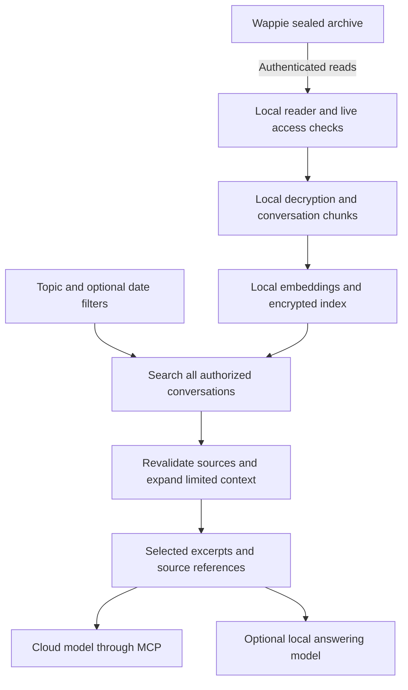

# Encrypted contextual search across conversations

**Status: future architecture proposal, reviewed on 2026-09-17.** This document
does not implement a persistent index, embeddings or a vector database. Bounded
lexical search through MCP is a separate delivery; the current tool contract is
documented in [MCP setup](mcp.md).

The intended experience is one question across all conversations within the
connection's authorized scope: for example, “What did we agree about delivery
delays this quarter?” Users should not have to identify a person or open each
conversation before searching. Results can connect relevant evidence from
different chats while preserving who said what, where and when.

## Privacy and deployment boundary

The recommended index runs in an authorized local companion process alongside
MCP. The Wappie archive server continues storing sealed content. Archive private
keys, decrypted text, embeddings and index keys stay outside that central server.
A user-managed machine could host the companion, but that machine then becomes
part of the user's trusted environment. The hosted MCP connector does not
change this: it is metadata-only and holds no key, so it cannot build or serve
this index. A cloud-hosted index would still require the separate, explicit
sharing decision described below.

Encryption at rest protects stored files. Search runs while the local process is
unlocked and can read the relevant content and vectors. This proposal does not
perform semantic search over ordinary archive ciphertext, and it does not
propose homomorphic encryption or a new searchable-encryption scheme.

Treat embeddings as sensitive content. Research has demonstrated recovery of
text and personal information from embeddings in tested settings; vectors are
not an anonymization mechanism.
[Embedding inversion research](https://aclanthology.org/2023.emnlp-main.765/)

Returning excerpts through MCP discloses those excerpts to the receiving model
service. OpenAI puts MCP output into model context, and Claude uses returned tool
results to continue its answer. A local MCP server or secure tunnel does not
change that boundary. Limit results to relevant excerpts and references, with
explicit permission to disclose plaintext. Keeping content entirely local also
requires a local answering model and a local interface rather than a cloud chat
host. [OpenAI MCP data flow](https://developers.openai.com/api/docs/guides/tools-connectors-mcp),
[Claude tool results](https://platform.claude.com/docs/en/agents-and-tools/tool-use/handle-tool-calls)

## Storage alternatives

| Approach | Advantages | Constraints | Proposed role |
| --- | --- | --- | --- |
| SQLCipher database with FTS5 and a tested vector extension | One transactional store for chunks, source metadata, word search, vectors and synchronization state. Incremental updates and removals. | Requires a verified native build and bindings. Extension storage and temporary files must remain inside the encryption boundary. | Preferred durable local architecture after a compatibility prototype. |
| Authenticated encrypted snapshots, searched in memory after unlocking | Small storage interface; index format and search implementation can be independent. No plaintext index file is required. | RAM and startup costs grow with the corpus. Updates, crash recovery and removal require careful snapshot replacement or encrypted segments. | Bounded prototype or explicit alternative when a supported native database is unavailable. |
| Remote vector service with provider-managed disk encryption | Managed operation and scaling. | A service that receives readable chunks or vectors becomes another trusted data processor. Provider disk encryption alone does not preserve the local-only boundary. | Outside the default design; requires a separate, explicit sharing decision. |

SQLCipher encrypts database pages and journal/WAL page data. Other temporary
files need separate attention: disable file-based temporary storage. It is a
specialized SQLite build, not a loadable encryption plugin for an ordinary SQLite
binary. These facts make packaging and spill-file tests release requirements.
[SQLCipher design and packaging](https://www.zetetic.net/sqlcipher/design/)

FTS5 supplies word/phrase retrieval; `sqlite-vec` is a candidate for vector
retrieval with metadata filtering. Its documentation currently describes a
pre-1.0 release. The upstream documentation is not evidence that a particular
SQLCipher, Node binding and vector-extension combination is supported. Pin and
test a complete combination before choosing it; do not assume an existing
SQLite package becomes encrypted by accepting an unknown PRAGMA.
[SQLite FTS5](https://www.sqlite.org/fts5.html),
[sqlite-vec](https://alexgarcia.xyz/sqlite-vec/),
[vector metadata filtering](https://alexgarcia.xyz/sqlite-vec/features/vec0.html)

For a snapshot prototype, prefer bounded exact vector search in RAM before
introducing an approximate index. A library such as Faiss supports memory-based
serialization, but warns that loading malicious index data can cause memory
exhaustion or code execution. If used, authenticate a locally generated encrypted
snapshot before parsing it, bound its size and declared dimensions, and never
load an arbitrary model-provided index path. Encryption does not make an unsafe
deserializer safe. [Faiss index I/O](https://github.com/facebookresearch/faiss/wiki/Index-IO%2C-cloning-and-hyper-parameter-tuning)

The compatibility prototype should verify supported desktop platforms, encrypted
reopen, transactional vector updates, filter correctness, deletion, interrupted
writes and performance at realistic archive sizes. If it fails, keep search
ephemeral or report the persistent feature unavailable. Never fall back silently
to a plaintext database.

## Keys and local files

- Generate a random, independent 256-bit index key per local installation,
  principal and workspace. Do not use an API token, login password or archive
  private key directly as the database key.
- Prefer operating-system protected key storage. A headless deployment needs an
  explicit protected secret-file or vault arrangement, owner-only file access
  and documented machine-level trust. A key next to its database with the same
  access permissions does not protect against compromise of that account.
- Bind the encrypted manifest to the normalized installation origin, current
  workspace, authenticated principal, random index ID, format version and
  generation. Keep sensitive labels and coverage details encrypted too.
- Verify the encryption backend and an actual keyed database read before
  accepting the store. SQLCipher supports keying through its API, and setting a
  key alone does not prove that a database can be opened. Keep key material out
  of SQL traces, command arguments and logs.
  [SQLCipher key handling](https://www.zetetic.net/sqlcipher/sqlcipher-api/)
- For snapshot storage, use a reviewed authenticated-encryption construction
  with unique nonces and authenticated manifest context. Commit completed
  encrypted generations atomically. Do not create plaintext staging files.
- Lock and close the index when the local session is locked or stopped. Clear
  owned sensitive buffers where possible; do not claim complete memory erasure
  in a garbage-collected runtime. Protect swap, crash dumps, diagnostics and
  backups at the operating-system level as well.
- Keep rebuild and removal simple. The index is derived data, not the archive
  source of truth. Losing its key requires rebuilding from currently authorized
  sources. Rotating an account credential does not automatically rotate the
  independent index key; specify both operations explicitly.

Do not enable arbitrary SQLite extensions, arbitrary file paths or remote
embedding endpoints from model tool arguments. Configuration belongs to the
user's local setup, outside the model's control.

## Scope and live authorization

Start with one configured installation and workspace per MCP connection. Search
all readable conversations of all configured numbers in that scope by default.
Optional number, chat or date filters narrow the search; they never widen access.
Searching several installations would be a later federation feature with
separate credentials, indexes and source labels.

Every source record needs at least:

- Installation origin, current authorization workspace and principal.
- Device ID and immutable `archive_tenant_id` used for opening sealed fields.
- Original stored chat key, verified alias group, message UID and root/revision
  identity; a display name is never an identity or authorization key.
- Message time, archive ingestion/change position, deletion state and index
  generation.

The archive namespace may remain unchanged after a number moves to another
workspace. It must not grant access in the old workspace. Use the current
workspace for authorization and the original archive namespace for cryptography,
following the [REST contract](rest-api.md).

Before a query, refresh the credential, membership, number whitelist, read
permissions and current grants. Apply that permitted set during retrieval.
Before releasing excerpts, fetch and validate their current source/history and
recheck access; discard missing, revoked or changed candidates and refresh their
index entries. Bound this work and return an explicit partial/error state when
validation cannot finish. Do not serve cached plaintext merely because the
archive is unreachable.

Revocation must cancel pending disclosure and quarantine the affected local
partition immediately, followed by deletion of its derived data. These are
controls of the cooperating client: a recipient who already copied plaintext or
keys cannot be forced to forget them. The server cannot retract excerpts already
sent to a model provider. An offline-cache mode would therefore need a separate
policy; it is not the default fallback for this design.

## Chunks and retrieval across chats

Index small, coherent windows within a conversation: adjacent messages about the
same exchange, speaker changes, timestamps and verified reply links. Keep source
UIDs for every text fragment. Tune token and time-gap limits on representative
data rather than treating one message as enough context or embedding an entire
long chat as one vector.

Do not concatenate unrelated chats into one chunk. Search the shared index
across chats, then group or compare the retrieved evidence in the answer. This
allows one topic to surface in several conversations without implying that
different participants were in the same exchange.

Use hybrid retrieval:

1. Validate the requested scope and time interval.
2. Combine word/phrase matches with semantic candidates across that scope.
3. Apply permission, time and current-revision filters before selecting results.
4. Deduplicate overlapping chunks and diversify sources so one busy chat does
   not hide relevant evidence elsewhere.
5. Revalidate selected sources, then expand a bounded neighboring/reply context.
6. Return excerpts with number/chat references, timestamps, revision identity
   and coverage. An optional local reranker can refine candidates later.

Exact search remains useful for names, codes, amounts and quoted phrases.
Semantic similarity can help with paraphrases, but neither similarity nor
recency proves a statement is correct. Resolve relative dates using the user's
timezone and an explicit reference date. Keep absent or uncertain timestamps
visible; do not silently substitute ingestion time for the time something was
said.

The default projection should represent the latest retained, nondeleted message
version. Historical revisions require an explicit historical mode, current
authorization and a clear revision label. The archive stores edits as separate
rows and message deletion as a control record; indexing every row as a current
statement would produce misleading results.
[Archive history model](../internal/store/history.go)

Treat all retrieved messages as untrusted conversation data, including apparent
instructions. They cannot change tool scope, choose another server, authorize a
new integration or cause a write operation.

## Embeddings and content coverage

Generate both document and query embeddings locally with the same pinned model,
tokenizer, dimensions and normalization. Store their versions with the chunker
version and a content fingerprint inside the encrypted index. A model or
chunking change creates a new index generation; incompatible vectors must not
be mixed silently.

Ollama is one possible local runtime: its embedding API accepts local requests,
and its local-only configuration can disable cloud features. This is an option
to evaluate, not a dependency selected by this proposal. Pin a local model,
restrict the endpoint to the configured local process and verify actual network
behavior. [Ollama embeddings](https://docs.ollama.com/capabilities/embeddings),
[Ollama local-only mode](https://docs.ollama.com/faq#how-do-i-disable-ollama-cloud-features)

A remote embedding API receives the text supplied for embedding. Choosing it
would disclose indexed text, potentially far more than the few excerpts returned
for an answer. Require a separate explicit choice; never enable it as a
performance fallback. [OpenAI embedding inputs](https://developers.openai.com/api/docs/guides/embeddings)

Evaluate Portuguese paraphrases, names, numbers, accents, mixed-language chats
and corrections before selecting a model. Begin with supported message text.
Attachments, audio transcripts, images and structured payloads need separate
authorized extraction and provenance before being counted as searchable.

Browser-imported personal contact names are separate local data. This design
does not automatically copy the browser's address book into MCP. Any later local
transfer needs a user-controlled mechanism, and labels must never change archive
identity, authorization or attribution.

## Synchronization, removal and honest coverage

The index needs complete source enumeration and durable change tracking before
it can claim full coverage. A chat-list limit, truncated response or interrupted
message scan is a partial corpus. Existing message cursors are not a frozen
snapshot, and a timestamp cursor alone cannot reliably discover late backfills,
edits to old messages or physically removed records.

Plan an authorized change stream or equivalent inventory protocol with:

- Stable ingestion/change positions distinct from message timestamps.
- An initial consistent inventory plus a watermark for subsequent changes.
- Explicit removals for retention, erasure, device migration and permission loss.
- Idempotent upserts and deletes committed with the local checkpoint.
- Gap detection, expiry of old change positions and mandatory full reconciliation
  when incremental continuation is no longer trustworthy.

Until that contract exists, use bounded scans and source revalidation, and label
coverage as partial. Do not infer complete removal by comparing against a
truncated inventory. [REST pagination](rest-api.md#paging-and-completeness),
[Archive retention and erasure](../internal/store/retention.go)

On an edit, rebuild every affected chunk and remove its obsolete vectors and
lexical entries. On deletion or loss of retention/access, remove dependent
chunks, cached excerpts, embeddings and generated summaries. Tombstones and
checkpoints must survive a restart, and restoring an older index must require
reconciliation before any disclosure.

Removal has a storage dimension too. FTS5 normally retains obsolete index
entries until merging; its secure-delete option and SQLite's core secure-delete
setting address different remnants. Verify both with the selected build, plus
vector shadow tables, journal lifecycle and backups. Do not promise forensic
erasure of old filesystem snapshots or SSD blocks.
[FTS5 deletion behavior](https://www.sqlite.org/fts5.html#the_secure_delete_configuration_option)

Each response should state the scope searched, requested time interval, indexed
intervals, synchronization watermark, last successful access check and relevant
gaps. Distinguish these outcomes:

- No match in a complete, current covered interval.
- No match in the available partial index.
- Content unavailable because of authorization, missing keys or server failure.

Even complete indexing of the available archive does not prove that the archive
contains every message ever present on a phone. Capture interruptions, missing
history and unsupported content must remain visible. Retrieval of a few good
matches also cannot justify claims such as “this never happened anywhere.”

## Proposed delivery sequence

1. **Bounded lexical search through MCP:** search across configured readable
   chats, return useful source references and explicit scan limits. No vector
   database is required for this step.
2. **Index foundations:** define complete inventory/change semantics; prototype
   SQLCipher packaging, key lifecycle, encrypted files and deletion. Establish
   reproducible synthetic evaluation data and resource limits.
3. **Persistent encrypted lexical index:** implement resumable indexing, live
   access checks, source validation, removal, recovery and coverage reporting.
   Keep search useful without an embedding or answering model.
4. **Local semantic and hybrid retrieval:** evaluate and pin an embedding model,
   add vectors, bounded context expansion and quality measurements. Scale the
   vector algorithm only when measured corpus size and latency justify it.
5. **Contextual answers:** add cited cross-chat synthesis, optional local
   reranking and a fully local answering path. Consider explicit multi-server
   federation and authorized media extraction after the same guarantees hold.

## Acceptance criteria for a future implementation

- Two installations with coincident IDs never share keys, entries or results;
  workspace moves preserve cryptographic namespace without old access.
- Revoked grants, expired tokens and whitelist changes block cached disclosure,
  including during a query and after restart or index restoration.
- Edits, deletions, retention, erasure, backfill and interrupted synchronization
  produce correct current results and accurate coverage after reconciliation.
- Wrong keys, tampered snapshots, malformed dimensions, excessive input and
  unsupported formats fail within explicit time and memory budgets.
- Synthetic plaintext canaries are absent from database files, temporary files,
  journals, logs and backups intended to be encrypted. Locked state cannot query
  the index. The unencrypted SQLite backend is rejected.
- No indexing text or query is sent to an embedding service in local-only mode;
  MCP receives only the permitted result excerpts and source metadata.
- Measured cross-chat retrieval finds relevant Portuguese paraphrases and exact
  facts, preserves corrections and dates, and avoids presenting partial coverage
  as a complete answer.

These criteria gate implementation choices; they are not claims about a
persistent search feature available today.
